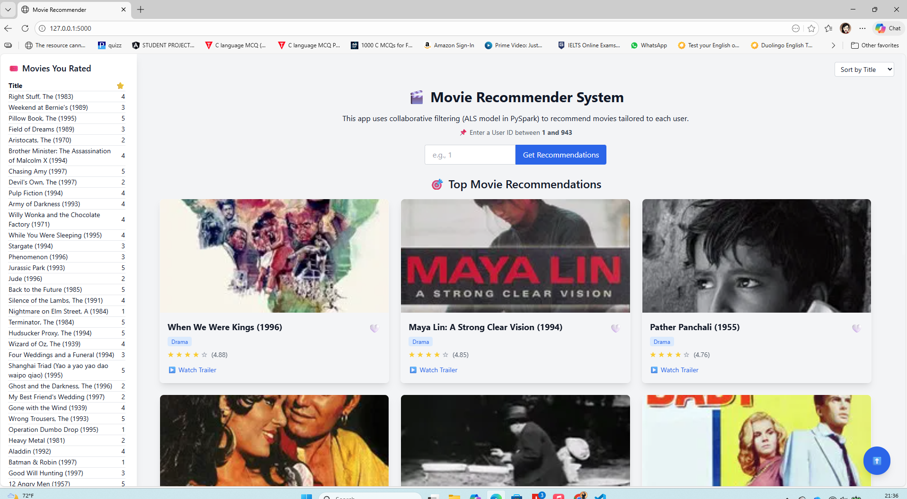

🎬 Movie Recommendation System (PySpark + Flask)

📌 Overview

A scalable movie recommendation web application built using PySpark's ALS collaborative filtering model and Flask.
The system trains on the MovieLens 100K dataset and generates personalized movie recommendations enriched with posters and trailers using the TMDB API.

🏗 System Architecture

Workflow:

User → Flask App → Spark ALS Model → TMDB API → Web UI

PySpark handles distributed model training
ALS generates top-N movie recommendations
TMDB API fetches posters and trailers
Flask serves dynamic recommendations to users

🧠 Machine Learning Model

Algorithm: Alternating Least Squares (ALS)
Approach: Collaborative Filtering
Dataset: MovieLens 100K
Train/Test Split: 80/20
Evaluation Metric: RMSE

📊 Model Performance

RMSE: (Replace with your printed RMSE value)

🛠 Tech Stack

Python
PySpark
Flask
Pandas
Java (Spark runtime)
TMDB API
Tailwind CSS

✨ Key Features

Personalized movie recommendations
Distributed model training using Spark
Movie posters & trailer integration
Sorting by title, rating, genre, year
Favorites system (localStorage)
Dark/Light mode UI
RMSE evaluation metric

📂 Project Structure
MovieRecommender/
│
├── data/                # MovieLens dataset
├── templates/           # HTML templates
├── app.py               # Flask application
├── recommender.py       # Spark ALS logic
├── requirements.txt     # Dependencies
└── README.md

🚀 How to Run Locally

1️⃣ Clone Repository
git clone https://github.com/yourusername/movie-recommender.git
cd movie-recommender
2️⃣ Create Virtual Environment
python -m venv venv
venv\Scripts\activate   # Windows
3️⃣ Install Dependencies
pip install -r requirements.txt
4️⃣ Run Application
python app.py

Open in browser:
http://127.0.0.1:5000

⚙ Requirements

Python 3.9+
Java 8/11/17/21
Spark (via PySpark)

🔮 Future Improvements

Save/load trained model to avoid retraining
Add authentication system
Deploy using Docker
Extract real genre features from dataset
Cloud deployment (AWS / Render)

📸 Demo

📄 License

This project is licensed under the MIT License.